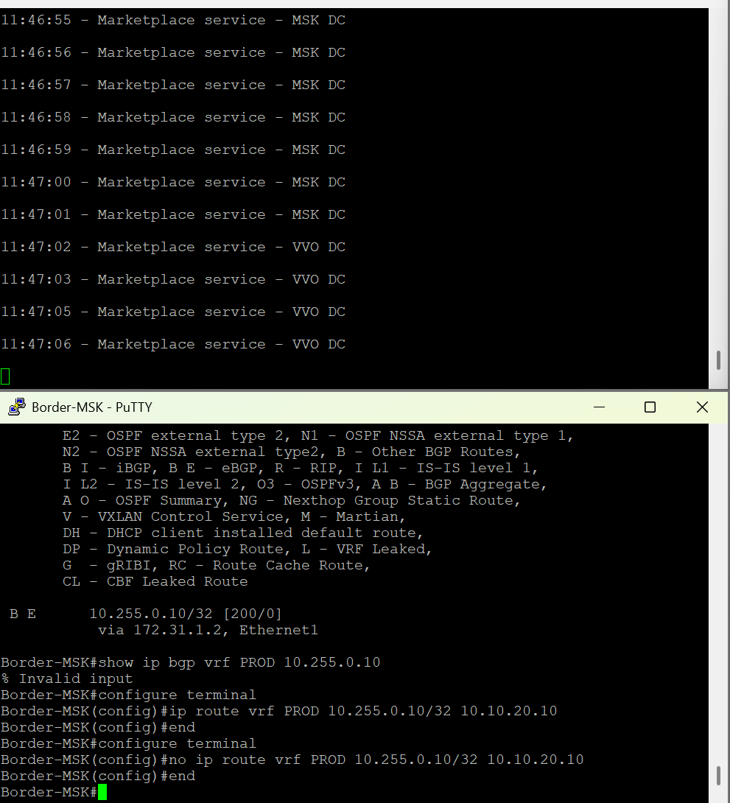

# Distributed VXLAN EVPN Fabric with DCI and Service Failover

Лабораторный проект моделирует распределенную VXLAN EVPN фабрику между двумя ЦОД:

* `DC-MSK` - основной ЦОД;
* `DC-VVO` - резервный ЦОД;
* Cisco C7200 `R-WAN` - L3 DCI/WAN transit между площадками;
* приложение развернуто в обоих ЦОД и использует общий сервисный VIP `10.255.0.10/32`;
* App-хосты подключены к MLAG-парам по двум линкам через Linux bond;
* клиент в каждом ЦОД обращается к одному VIP и получает локальный сервис в штатном режиме;
* при выводе локального VIP route в MSK клиент автоматически начинает получать ответ от VVO через DCI.

.jpg)

## Цели проекта

1. Построить два независимых VXLAN EVPN fabric: `DC-MSK` и `DC-VVO`.
2. Реализовать eBGP underlay и EVPN control plane.
3. Настроить MLAG для dual-homed App-хостов.
4. Использовать L2VNI для VLAN приложения и L3VNI для VRF `PROD`.
5. Организовать L3 DCI между ЦОД через Cisco C7200.
6. Обеспечить локальную предпочтительность сервиса в каждом ЦОД.
7. Продемонстрировать переключение VIP `10.255.0.10` с MSK на VVO.
8. Подтвердить сохранение доступности приложения при отказе одного member-link в MLAG/bond.

---

## Архитектура

```text
                         ┌─────────────────────────────┐
                         │           R-WAN             │
                         │      Cisco C7200, AS 65500   │
                         └────────────┬───────┬─────────┘
                                      │       │
                             172.31.1.0/30  172.31.2.0/30
                                      │       │
              ┌───────────────────────┘       └───────────────────────┐
              │                                                         │
      ┌───────▼────────┐                                       ┌───────▼────────┐
      │  Border-MSK    │                                       │  Border-VVO    │
      │  AS 65102      │                                       │  AS 65202      │
      │  VTEP          │                                       │  VTEP          │
      └───────┬────────┘                                       └───────┬────────┘
              │ MLAG peer-link                                         │ MLAG peer-link
      ┌───────▼────────┐                                       ┌───────▼────────┐
      │   Leaf-MSK     │                                       │   Leaf-VVO     │
      │   AS 65101     │                                       │   AS 65201     │
      │   VTEP         │                                       │   VTEP         │
      └───────┬────────┘                                       └───────┬────────┘
              │                                                         │
        App-MSK, VLAN 20                                          App-VVO, VLAN 20
        10.10.20.10/24                                            10.20.20.10/24
        VIP 10.255.0.10/32                                        VIP 10.255.0.10/32
              │                                                         │
      ┌───────▼────────┐                                       ┌───────▼────────┐
      │   Spine-MSK    │                                       │   Spine-VVO    │
      │   AS 65000     │                                       │   AS 65010     │
      └────────────────┘                                       └────────────────┘
```

## Роли устройств

| Устройство | Роль                                                    |    AS |
| ---------- | ------------------------------------------------------- | ----: |
| Spine-MSK  | Spine / EVPN route-reflector-like transit в eBGP fabric | 65000 |
| Leaf-MSK   | Leaf и VTEP в DC-MSK, MLAG peer                         | 65101 |
| Border-MSK | Border Leaf, VTEP, MLAG peer, DCI edge                  | 65102 |
| Spine-VVO  | Spine / EVPN transit в DC-VVO                           | 65010 |
| Leaf-VVO   | Leaf и VTEP в DC-VVO, MLAG peer                         | 65201 |
| Border-VVO | Border Leaf, VTEP, MLAG peer, DCI edge                  | 65202 |
| R-WAN      | L3 DCI/WAN router, не является VTEP                     | 65500 |
| App-MSK    | Marketplace service в DC-MSK                            |     - |
| App-VVO    | Marketplace service в DC-VVO                            |     - |
| Client-MSK | Внешний клиент MSK                                      |     - |
| Client-VVO | Внешний клиент VVO                                      |     - |

---

## Адресный план

### Underlay

| Линк                   | Подсеть       | Сторона A            | Сторона B             |
| ---------------------- | ------------- | -------------------- | --------------------- |
| Spine-MSK - Leaf-MSK   | `10.1.0.0/31` | Spine-MSK `10.1.0.0` | Leaf-MSK `10.1.0.1`   |
| Spine-MSK - Border-MSK | `10.1.0.2/31` | Spine-MSK `10.1.0.2` | Border-MSK `10.1.0.3` |
| Spine-VVO - Border-VVO | `10.2.0.0/31` | Spine-VVO `10.2.0.0` | Border-VVO `10.2.0.1` |
| Spine-VVO - Leaf-VVO   | `10.2.0.2/31` | Spine-VVO `10.2.0.2` | Leaf-VVO `10.2.0.3`   |

### Loopback и VTEP адреса

| Устройство | Loopback0        | VTEP Loopback1    |
| ---------- | ---------------- | ----------------- |
| Spine-MSK  | `1.1.1.1/32`     | -                 |
| Leaf-MSK   | `11.11.11.11/32` | `100.100.1.12/32` |
| Border-MSK | `13.13.13.13/32` | `100.100.1.12/32` |
| Spine-VVO  | `2.2.2.2/32`     | -                 |
| Leaf-VVO   | `22.22.22.22/32` | `100.100.2.12/32` |
| Border-VVO | `23.23.23.23/32` | `100.100.2.12/32` |

В каждой MLAG-паре используется общий anycast VTEP:

```text
DC-MSK: 100.100.1.12/32
DC-VVO: 100.100.2.12/32
```

### Сегменты приложений и внешних клиентов

| Назначение             | DC-MSK           | DC-VVO           |
| ---------------------- | ---------------- | ---------------- |
| App VLAN               | VLAN 20          | VLAN 20          |
| L2VNI                  | `10020`          | `20020`          |
| App subnet             | `10.10.20.0/24`  | `10.20.20.0/24`  |
| Anycast gateway        | `10.10.20.1`     | `10.20.20.1`     |
| App host               | `10.10.20.10`    | `10.20.20.10`    |
| External client subnet | `192.0.2.0/30`   | `192.0.2.4/30`   |
| Border address         | `192.0.2.1`      | `192.0.2.5`      |
| Client address         | `192.0.2.2`      | `192.0.2.6`      |
| Shared service VIP     | `10.255.0.10/32` | `10.255.0.10/32` |

### DCI и MLAG peer transit

| Назначение            | Подсеть           | Адреса                                             |
| --------------------- | ----------------- | -------------------------------------------------- |
| DCI MSK - R-WAN       | `172.31.1.0/30`   | Border-MSK `172.31.1.1`, R-WAN `172.31.1.2`        |
| DCI VVO - R-WAN       | `172.31.2.0/30`   | Border-VVO `172.31.2.1`, R-WAN `172.31.2.2`        |
| MLAG peer transit MSK | `172.30.100.0/30` | Leaf-MSK `172.30.100.1`, Border-MSK `172.30.100.2` |
| MLAG peer transit VVO | `172.30.200.0/30` | Leaf-VVO `172.30.200.1`, Border-VVO `172.30.200.2` |

---

## Control plane

### eBGP underlay

Каждый Leaf и Border Leaf поднимает eBGP-сессию со своим Spine:

```text
DC-MSK:
Spine-MSK AS 65000 <-> Leaf-MSK AS 65101
Spine-MSK AS 65000 <-> Border-MSK AS 65102

DC-VVO:
Spine-VVO AS 65010 <-> Leaf-VVO AS 65201
Spine-VVO AS 65010 <-> Border-VVO AS 65202
```

Через underlay распространяются loopback-адреса и anycast VTEP адреса.

### EVPN control plane

EVPN address-family активирован между Spine и Leaf/Border Leaf.

Используются:

```text
VRF: PROD
L3VNI: 50100
Route Target import/export: 50100:50100
```

L2 VNI:

```text
DC-MSK, VLAN 20: VNI 10020
DC-VVO, VLAN 20: VNI 20020
```

В рамках каждого ЦОД EVPN распространяет IP-prefix routes для VRF `PROD`, включая локальные connected сети, сервисный VIP и маршруты, полученные через DCI.

---

## MLAG и подключение приложений

В каждом ЦОД настроена MLAG-пара:

```text
DC-MSK: Leaf-MSK + Border-MSK
DC-VVO: Leaf-VVO + Border-VVO
```

Параметры MLAG:

| Параметр              | DC-MSK          | DC-VVO          |
| --------------------- | --------------- | --------------- |
| MLAG domain-id        | `MLAG_MSK`      | `MLAG_VVO`      |
| Peer VLAN             | VLAN 4094       | VLAN 4094       |
| Peer-link             | Port-Channel100 | Port-Channel100 |
| Peer-link protocol    | LACP            | LACP            |
| App Port-Channel      | Port-Channel10  | Port-Channel10  |
| App Port-Channel mode | Static          | Static          |
| MLAG ID               | 10              | 10              |

App-хосты используют Linux bonding:

```text
mode: balance-xor
xmit_hash_policy: layer3+4
slaves: ens3, ens4
miimon: 100
```

Каждый App-хост имеет два uplink-интерфейса, подключенных к двум разным участникам MLAG-пары.

```text
App-MSK:
ens3/ens4 -> MLAG Port-Channel10 в DC-MSK

App-VVO:
ens3/ens4 -> MLAG Port-Channel10 в DC-VVO
```

---

## Зачем нужен MLAG peer transit VLAN 4093

Border Leaf является north-south и DCI edge устройством. Leaf должен иметь гарантированный путь для обратного трафика к внешним клиентам и DCI.

Для этого внутри каждой MLAG-пары добавлен L3 transit в VRF `PROD`:

```text
DC-MSK:
Leaf-MSK 172.30.100.1/30 <-> Border-MSK 172.30.100.2/30

DC-VVO:
Leaf-VVO 172.30.200.1/30 <-> Border-VVO 172.30.200.2/30
```

На Leaf настроен default route в сторону Border:

```text
Leaf-MSK:
ip route vrf PROD 0.0.0.0/0 172.30.100.2

Leaf-VVO:
ip route vrf PROD 0.0.0.0/0 172.30.200.2
```

Это обеспечивает детерминированный return path:

```text
App -> Leaf -> peer transit -> Border -> external client / DCI
```

---

## DCI

Cisco C7200 выполняет только L3 transit-функцию между двумя ЦОД.

```text
Border-MSK <-> R-WAN <-> Border-VVO
```

R-WAN не является VTEP и не участвует в VXLAN encapsulation.

BGP-сессии DCI:

```text
Border-MSK AS 65102 <-> R-WAN AS 65500
Border-VVO AS 65202 <-> R-WAN AS 65500
```

Через DCI распространяются:

```text
10.255.0.10/32
192.0.2.0/30
192.0.2.4/30
```

Для ограничения рекламы применяется route-map `DCI_ALLOWED`.

---

## Модель доступа внешних клиентов

Внешние клиенты подключены напрямую к routed interface на Border Leaf:

```text
Client-MSK -> Border-MSK Ethernet4
Client-VVO -> Border-VVO Ethernet4
```

Это намеренное упрощение лабораторного стенда.

В реальной сети клиент находился бы за ISP, Internet edge или региональной сетью доступа. В данной работе прямое L3-подключение эмулирует путь пользователя через внешнего провайдера и позволяет сосредоточиться на VXLAN EVPN, MLAG, DCI и сервисном failover.

---

## Сервисная модель

На App-MSK и App-VVO запущен HTTP-сервис на TCP/8080.

```text
VIP: 10.255.0.10/32
```

Ответы приложений отличаются:

```text
Marketplace service - MSK DC
Marketplace service - VVO DC
```

В штатном режиме Border Leaf предпочитает локальный сервис за счет static route:

```text
Border-MSK:
ip route vrf PROD 10.255.0.10/32 10.10.20.10

Border-VVO:
ip route vrf PROD 10.255.0.10/32 10.20.20.10
```

Таким образом:

```text
Client-MSK -> VIP -> App-MSK
Client-VVO -> VIP -> App-VVO
```

---

## Проверка штатного состояния

### MLAG

На обеих MLAG-парах подтверждено:

```text
MLAG state: Active
Peer-link status: Up
Local interface status: Up
MLAG ports Active-full: 1
```

Port-Channel приложения находится в состоянии `connected`:

```text
Po10 connected, VLAN 20, 2G
```

### Linux bond

На App-MSK и App-VVO:

```text
bond0: UP
mode: balance-xor
ens3: carrier 1
ens4: carrier 1
marketplace.service: active
```

### Доступность сервисов

Client-MSK:

```text
PING 10.255.0.10: 3 packets transmitted, 3 received
Marketplace service - MSK DC
```

Client-VVO:

```text
PING 10.255.0.10: 3 packets transmitted, 3 received
Marketplace service - VVO DC
```

---

## Тест 1. Failover member-link в MLAG

Проверялся отказ одного линка App-MSK - Leaf-MSK.

Логика теста:

```text
1. На Leaf-MSK выключается интерфейс к App-MSK.
2. На App-MSK соответствующий slave-интерфейс выводится в down.
3. bond0 остается UP.
4. Трафик продолжает проходить через оставшийся member-link.
```

Во время переключения был зафиксирован кратковременный reconvergence interval с единичными потерями HTTP-запросов. После этого запросы стабильно продолжили обслуживаться сервисом MSK:

```text
Marketplace service - MSK DC
```

Особенность GNS3:

```text
Administrative shutdown на vEOS не всегда передает carrier-down
в виртуальную NIC Ubuntu.

Поэтому отказ моделировался с обеих сторон:
- shutdown физического switchport на vEOS;
- ip link set <slave> down на App-хосте.
```

Результат теста:

```text
MLAG и Linux bond сохранили доступность приложения после отказа одного member-link.
```

---

## Тест 2. МежЦОДовый failover VIP

В нормальном состоянии на Border-MSK присутствует локальный static route:

```text
S 10.255.0.10/32 via 10.10.20.10, Vlan20
```

На Client-MSK выполнялся циклический HTTP-запрос:

```bash
while true; do
  printf '%s - ' "$(date +%T)"
  curl --noproxy '*' --connect-timeout 3 -s http://10.255.0.10:8080 || echo 'REQUEST FAILED'
  echo
  sleep 1
done
```

До отказа клиент получал:

```text
Marketplace service - MSK DC
```

Для моделирования недоступности локального сервиса на Border-MSK удалялся local VIP route:

```eos
configure terminal
no ip route vrf PROD 10.255.0.10/32 10.10.20.10
end
```

После BGP convergence Border-MSK установил удаленный маршрут:

```text
B E 10.255.0.10/32
  via 172.31.1.2, Ethernet1
```

Путь трафика изменился:

```text
Client-MSK
  -> Border-MSK
  -> R-WAN
  -> Border-VVO
  -> App-VVO
```

Клиент начал получать:

```text
Marketplace service - VVO DC
```



После проверки основной маршрут MSK был восстановлен:

```eos
configure terminal
ip route vrf PROD 10.255.0.10/32 10.10.20.10
end
write memory
```

И Client-MSK снова начал получать локальный сервис:

```text
Marketplace service - MSK DC
```

---

## Команды верификации

### MLAG

```eos
show mlag
show port-channel dense
show interfaces port-channel 10 status
show mac address-table vlan 20
```

### VXLAN EVPN

```eos
show vxlan vni
show vxlan vtep
show bgp evpn summary
show bgp evpn route-type ip-prefix ipv4
```

### VRF и DCI

```eos
show ip route vrf PROD
show ip route vrf PROD 10.255.0.10
show ip bgp vrf PROD 10.255.0.10
```

### R-WAN

```cisco
show ip interface brief
show ip bgp summary
show ip bgp 10.255.0.10
show ip route 10.255.0.10
show ip route 192.0.2.0
show ip route 192.0.2.4
```

### App hosts

```bash
ip -br addr
ip route
cat /sys/class/net/bond0/bonding/mode
cat /sys/class/net/bond0/bonding/slaves
ip -d link show bond0
systemctl is-active marketplace.service
curl --noproxy '*' http://10.255.0.10:8080
```

---

## Ограничения стенда

1. В каждом ЦОД используется только один Spine. Потеря Spine приведет к потере underlay connectivity для подключенных к нему Leaf/Border Leaf.

2. Используется один Cisco C7200 `R-WAN`. Он является SPOF для DCI между площадками.

3. Переключение VIP реализовано удалением локального static route. Это контролируемая routing-модель, а не production-grade автоматический health check.

4. Внешние клиенты подключены напрямую к Border Leaf. Это лабораторная эмуляция ISP/Internet access, а не полноценная внешняя сеть.

5. Из-за особенностей виртуального окружения GNS3 потеря physical carrier на vEOS не всегда передается в Ubuntu guest. Для корректного MLAG failover теста отказ member-link моделировался также на стороне Linux bond.

---

## Структура репозитория

```text
dci-vxlan-evpn-ha/
├── config/
│   ├── Spine-MSK.cfg
│   ├── Leaf-MSK.cfg
│   ├── Border-MSK.cfg
│   ├── R-WAN-C7200.cfg
│   ├── Spine-VVO.cfg
│   ├── Leaf-VVO.cfg
│   └── Border-VVO.cfg
├── README.md
├── topology (3).jpg
└── vip-failover-msk-to-vvo.png
```

---

## Итог

В проекте реализована распределенная VXLAN EVPN архитектура между двумя ЦОД с L3 DCI через Cisco C7200.

Подтверждены следующие сценарии:

```text
[OK] eBGP underlay между Spine и Leaf/Border Leaf
[OK] EVPN control plane
[OK] L2VNI и L3VNI в VRF PROD
[OK] MLAG между Leaf и Border Leaf в каждом ЦОД
[OK] Dual-homed App через Linux bond balance-xor
[OK] Доступ клиентов к локальному сервису по общему VIP
[OK] L3 DCI через Cisco C7200
[OK] Переключение Client-MSK на App-VVO после вывода local VIP route
[OK] Сохранение доступности App при отказе одного member-link
```

