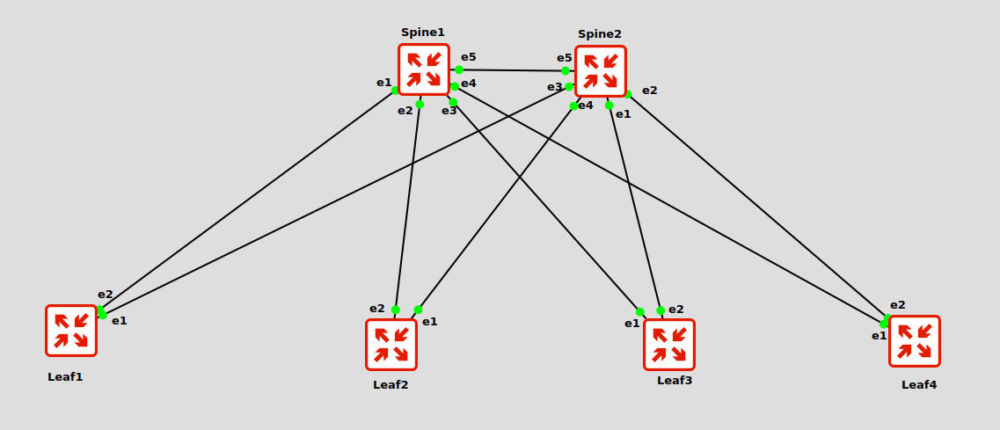

# Лабораторная работа №2 - OSPF Underlay

## Цель работы

Настроить OSPF underlay сеть в топологии Spine-Leaf для обеспечения IP связности между всеми сетевыми устройствами.

---

## План работы

1. Построить топологию Spine-Leaf
2. Настроить L3 интерфейсы между устройствами
3. Назначить IP адресацию
4. Включить IP routing
5. Настроить OSPF
6. Проверить OSPF соседства
7. Проверить IP связность между Loopback интерфейсами

---

## Схема сети



---

## Адресное пространство

### Loopback интерфейсы

| Устройство | Интерфейс | IP адрес |
|---|---|---|
| Spine1 | Loopback0 | 1.1.1.1/32 |
| Spine2 | Loopback0 | 2.2.2.2/32 |
| Leaf1 | Loopback0 | 11.11.11.11/32 |
| Leaf2 | Loopback0 | 22.22.22.22/32 |
| Leaf3 | Loopback0 | 33.33.33.33/32 |
| Leaf4 | Loopback0 | 44.44.44.44/32 |

---

### P2P соединения

| Устройство | Интерфейс | IP адрес |
|---|---|---|
| Spine1 | Ethernet5 | 10.0.0.0/31 |
| Spine2 | Ethernet5 | 10.0.0.1/31 |
| Spine1 | Ethernet1 | 10.0.0.2/31 |
| Leaf1 | Ethernet2 | 10.0.0.3/31 |
| Spine1 | Ethernet2 | 10.0.0.4/31 |
| Leaf2 | Ethernet2 | 10.0.0.5/31 |
| Spine1 | Ethernet3 | 10.0.0.6/31 |
| Leaf3 | Ethernet1 | 10.0.0.7/31 |
| Spine1 | Ethernet4 | 10.0.0.8/31 |
| Leaf4 | Ethernet1 | 10.0.0.9/31 |
| Spine2 | Ethernet1 | 10.0.0.10/31 |
| Leaf3 | Ethernet2 | 10.0.0.11/31 |
| Spine2 | Ethernet2 | 10.0.0.12/31 |
| Leaf4 | Ethernet2 | 10.0.0.13/31 |
| Spine2 | Ethernet3 | 10.0.0.14/31 |
| Leaf1 | Ethernet1 | 10.0.0.15/31 |
| Spine2 | Ethernet4 | 10.0.0.16/31 |
| Leaf2 | Ethernet1 | 10.0.0.17/31 |

---

## Конфигурация устройств

Конфигурации устройств расположены в директории:

```text
configs/
```

### Список конфигураций

- Spine1.cfg
- Spine2.cfg
- Leaf1.cfg
- Leaf2.cfg
- Leaf3.cfg
- Leaf4.cfg

---

## Проверка OSPF соседства

### Spine1

```bash
Spine1#show ip ospf neighbor

Neighbor ID     Pri State   Dead Time Address    Interface
33.33.33.33       0 FULL    00:00:37 10.0.0.7   Ethernet3
44.44.44.44       0 FULL    00:00:33 10.0.0.9   Ethernet4
2.2.2.2           0 FULL    00:00:35 10.0.0.1   Ethernet5
11.11.11.11       0 FULL    00:00:30 10.0.0.3   Ethernet1
22.22.22.22       0 FULL    00:00:30 10.0.0.5   Ethernet2
```

---

## Проверка таблицы маршрутизации

```bash
Spine1#show ip route ospf
```

---

## Проверка IP связности

### Ping между Loopback интерфейсами

```bash
Leaf2#ping 44.44.44.44 source loopback0

PING 44.44.44.44 (44.44.44.44) from 22.22.22.22 : 72(100) bytes of data.
80 bytes from 44.44.44.44: icmp_seq=1 ttl=63 time=2.43 ms
80 bytes from 44.44.44.44: icmp_seq=2 ttl=63 time=1.33 ms
80 bytes from 44.44.44.44: icmp_seq=3 ttl=63 time=0.924 ms
80 bytes from 44.44.44.44: icmp_seq=4 ttl=63 time=1.20 ms
80 bytes from 44.44.44.44: icmp_seq=5 ttl=63 time=0.946 ms

--- 44.44.44.44 ping statistics ---
5 packets transmitted, 5 received, 0% packet loss
```

---

## Вывод

В рамках лабораторной работы была построена Spine-Leaf топология и настроен OSPF underlay.

Между всеми устройствами установлены OSPF соседства и обеспечена IP связность между Loopback интерфейсами.

Underlay сеть функционирует корректно.
