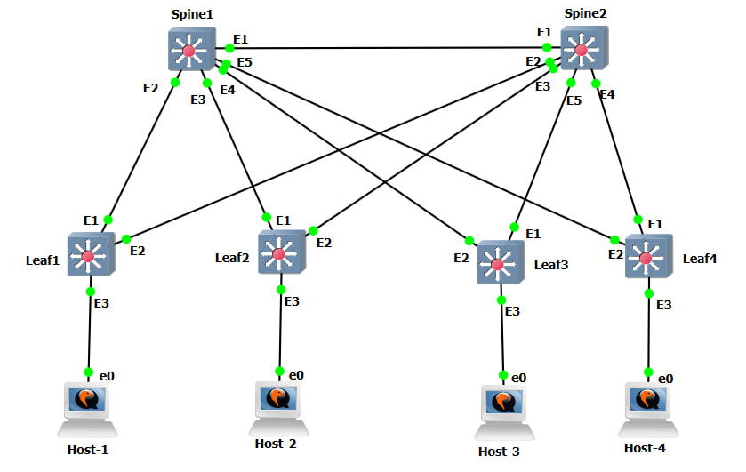

# VXLAN EVPN L3VNI

## Цель

Настроить маршрутизацию в overlay между клиентами, расположенными в разных L2VNI, с использованием VXLAN EVPN и L3VNI.

## Топология



Лабораторная схема состоит из двух Spine, четырех Leaf и четырех Ubuntu-hosts. Каждый Leaf подключен к обоим Spine. Каждый хост подключен к своему Leaf через access-порт.

## Используемая модель

В лабораторной работе используется следующая модель:

- Underlay - eBGP по point-to-point линкам
- Overlay - eBGP EVPN
- Route Reflector - не используется
- VXLAN source-interface - Loopback1 на Leaf
- Каждый клиент размещен в отдельном VLAN и L2VNI
- Между клиентскими сетями работает маршрутизация через общий VRF `TENANT` и L3VNI `50000`
- Для клиентских VLAN используется Anycast Gateway через `ip address virtual`

## Устройства и AS numbers

| Устройство | ASN | Loopback0 | Loopback1 VTEP |
|---|---:|---:|---:|
| Spine1 | 65000 | 1.1.1.1/32 | - |
| Spine2 | 65001 | 2.2.2.2/32 | - |
| Leaf1 | 65101 | 11.11.11.11/32 | 100.100.100.1/32 |
| Leaf2 | 65102 | 22.22.22.22/32 | 100.100.100.2/32 |
| Leaf3 | 65103 | 33.33.33.33/32 | 100.100.100.3/32 |
| Leaf4 | 65104 | 44.44.44.44/32 | 100.100.100.4/32 |

## Underlay адресация

| Линк | Сеть | Устройство A | IP A | Устройство B | IP B |
|---|---:|---|---:|---|---:|
| Spine1 - Spine2 | 10.0.0.16/31 | Spine1 Ethernet1 | 10.0.0.16 | Spine2 Ethernet1 | 10.0.0.17 |
| Spine1 - Leaf1 | 10.0.0.0/31 | Spine1 Ethernet2 | 10.0.0.0 | Leaf1 Ethernet1 | 10.0.0.1 |
| Spine1 - Leaf2 | 10.0.0.2/31 | Spine1 Ethernet3 | 10.0.0.2 | Leaf2 Ethernet1 | 10.0.0.3 |
| Spine1 - Leaf3 | 10.0.0.4/31 | Spine1 Ethernet4 | 10.0.0.4 | Leaf3 Ethernet2 | 10.0.0.5 |
| Spine1 - Leaf4 | 10.0.0.6/31 | Spine1 Ethernet5 | 10.0.0.6 | Leaf4 Ethernet2 | 10.0.0.7 |
| Spine2 - Leaf1 | 10.0.0.8/31 | Spine2 Ethernet2 | 10.0.0.8 | Leaf1 Ethernet2 | 10.0.0.9 |
| Spine2 - Leaf2 | 10.0.0.10/31 | Spine2 Ethernet3 | 10.0.0.10 | Leaf2 Ethernet2 | 10.0.0.11 |
| Spine2 - Leaf3 | 10.0.0.12/31 | Spine2 Ethernet5 | 10.0.0.12 | Leaf3 Ethernet1 | 10.0.0.13 |
| Spine2 - Leaf4 | 10.0.0.14/31 | Spine2 Ethernet4 | 10.0.0.14 | Leaf4 Ethernet1 | 10.0.0.15 |

## Клиентские VLAN, VNI и адресация

| Host | Leaf | VLAN | L2VNI | IP host | Gateway |
|---|---|---:|---:|---:|---:|
| Host1 | Leaf1 | 10 | 10010 | 10.10.10.10/24 | 10.10.10.1 |
| Host2 | Leaf2 | 20 | 10020 | 10.20.20.10/24 | 10.20.20.1 |
| Host3 | Leaf3 | 30 | 10030 | 10.30.30.10/24 | 10.30.30.1 |
| Host4 | Leaf4 | 40 | 10040 | 10.40.40.10/24 | 10.40.40.1 |

Общий L3VNI:

| VRF | L3VNI |
|---|---:|
| TENANT | 50000 |

## Конфигурации устройств

Полные конфигурации устройств находятся в каталоге [configs](./configs/):

- [Spine1.cfg](./configs/Spine1.cfg)
- [Spine2.cfg](./configs/Spine2.cfg)
- [Leaf1.cfg](./configs/Leaf1.cfg)
- [Leaf2.cfg](./configs/Leaf2.cfg)
- [Leaf3.cfg](./configs/Leaf3.cfg)
- [Leaf4.cfg](./configs/Leaf4.cfg)

## Проверка Underlay BGP

### Spine1

```text
Spine1#show ip bgp summary
BGP summary information for VRF default
Router identifier 1.1.1.1, local AS number 65000
  Neighbor  V AS           Up/Down State   PfxRcd PfxAcc
  10.0.0.1  4 65101        00:56:22 Estab   3      3
  10.0.0.3  4 65102        00:56:19 Estab   3      3
  10.0.0.5  4 65103        00:56:18 Estab   3      3
  10.0.0.7  4 65104        00:56:20 Estab   3      3
  10.0.0.17 4 65001        00:56:27 Estab   9      9
```

### Spine2

```text
Spine2#show ip bgp summary
BGP summary information for VRF default
Router identifier 2.2.2.2, local AS number 65001
  Neighbor  V AS           Up/Down State   PfxRcd PfxAcc
  10.0.0.9  4 65101        00:56:32 Estab   9      9
  10.0.0.11 4 65102        00:56:29 Estab   9      9
  10.0.0.13 4 65103        00:56:28 Estab   9      9
  10.0.0.15 4 65104        00:56:30 Estab   9      9
  10.0.0.16 4 65000        00:56:37 Estab   9      9
```

## Проверка EVPN BGP

### Spine1

```text
Spine1#show bgp evpn summary
BGP summary information for VRF default
Router identifier 1.1.1.1, local AS number 65000
  Neighbor  V AS           Up/Down State   PfxRcd PfxAcc
  10.0.0.1  4 65101        00:56:22 Estab   5      5
  10.0.0.3  4 65102        00:56:19 Estab   6      6
  10.0.0.5  4 65103        00:56:18 Estab   4      4
  10.0.0.7  4 65104        00:56:20 Estab   5      5
  10.0.0.17 4 65001        00:56:27 Estab   12     12
```

### Spine2

```text
Spine2#show bgp evpn summary
BGP summary information for VRF default
Router identifier 2.2.2.2, local AS number 65001
  Neighbor  V AS           Up/Down State   PfxRcd PfxAcc
  10.0.0.9  4 65101        00:56:32 Estab   10     10
  10.0.0.11 4 65102        00:56:29 Estab   9      9
  10.0.0.13 4 65103        00:56:28 Estab   11     11
  10.0.0.15 4 65104        00:56:30 Estab   10     10
  10.0.0.16 4 65000        00:56:37 Estab   12     12
```

## Проверка EVPN маршрутов

На Spine присутствуют EVPN маршруты типов `mac-ip`, `imet` и `ip-prefix`. Для L3VNI важны Type-5 `ip-prefix` маршруты клиентских сетей.

Фрагмент вывода `show bgp evpn` на Spine1:

```text
RD: 100.100.100.1:50000 ip-prefix 10.10.10.0/24
                                100.100.100.1         -       100     0       65101 i
RD: 100.100.100.2:50000 ip-prefix 10.20.20.0/24
                                100.100.100.2         -       100     0       65102 i
RD: 100.100.100.3:50000 ip-prefix 10.30.30.0/24
                                100.100.100.3         -       100     0       65103 i
RD: 100.100.100.4:50000 ip-prefix 10.40.40.0/24
                                100.100.100.4         -       100     0       65104 i
```

## Проверка маршрутизации в VRF TENANT

### Leaf1

```text
Leaf1#show ip route vrf TENANT

VRF: TENANT
Gateway of last resort is not set

 C        10.10.10.0/24
           directly connected, Vlan10
 B E      10.20.20.0/24 [200/0]
           via VTEP 100.100.100.2 VNI 50000 router-mac 0c:33:33:67:b1:eb local-interface Vxlan1
 B E      10.30.30.0/24 [200/0]
           via VTEP 100.100.100.3 VNI 50000 router-mac 0c:20:2c:09:d4:31 local-interface Vxlan1
 B E      10.40.40.0/24 [200/0]
           via VTEP 100.100.100.4 VNI 50000 router-mac 0c:6b:d7:be:d2:ae local-interface Vxlan1
```

### Leaf4

```text
Leaf4#show ip route vrf TENANT

VRF: TENANT
Gateway of last resort is not set

 B E      10.10.10.0/24 [200/0]
           via VTEP 100.100.100.1 VNI 50000 router-mac 0c:3b:57:af:e1:a1 local-interface Vxlan1
 B E      10.20.20.0/24 [200/0]
           via VTEP 100.100.100.2 VNI 50000 router-mac 0c:33:33:67:b1:eb local-interface Vxlan1
 B E      10.30.30.0/24 [200/0]
           via VTEP 100.100.100.3 VNI 50000 router-mac 0c:20:2c:09:d4:31 local-interface Vxlan1
 C        10.40.40.0/24
           directly connected, Vlan40
```

## Проверка VNI

### Leaf1

```text
Leaf1#show vxlan vni
VNI to VLAN Mapping for Vxlan1
VNI         VLAN       Source       Interface       802.1Q Tag
----------- ---------- ------------ --------------- ----------
10010       10         static       Ethernet3       untagged
                                    Vxlan1          10

VNI to dynamic VLAN Mapping for Vxlan1
VNI         VLAN       VRF          Source
----------- ---------- ------------ ------------
50000       4097       TENANT       evpn
```

### Leaf4

```text
Leaf4#show vxlan vni
VNI to VLAN Mapping for Vxlan1
VNI         VLAN       Source       Interface       802.1Q Tag
----------- ---------- ------------ --------------- ----------
10040       40         static       Ethernet3       untagged
                                    Vxlan1          40

VNI to dynamic VLAN Mapping for Vxlan1
VNI         VLAN       VRF          Source
----------- ---------- ------------ ------------
50000       4097       TENANT       evpn
```

## Проверка EVPN Type-5 на Leaf

### Leaf1

```text
Leaf1#show bgp evpn route-type ip-prefix ipv4
          Network                Next Hop              Metric  LocPref Weight  Path
 * >      RD: 100.100.100.1:50000 ip-prefix 10.10.10.0/24
                                 -                     -       -       0       i
 * >      RD: 100.100.100.2:50000 ip-prefix 10.20.20.0/24
                                 100.100.100.2         -       100     0       65000 65102 i
 * >      RD: 100.100.100.3:50000 ip-prefix 10.30.30.0/24
                                 100.100.100.3         -       100     0       65000 65103 i
 * >      RD: 100.100.100.4:50000 ip-prefix 10.40.40.0/24
                                 100.100.100.4         -       100     0       65000 65104 i
```

### Leaf4

```text
Leaf4#show bgp evpn route-type ip-prefix ipv4
          Network                Next Hop              Metric  LocPref Weight  Path
 * >      RD: 100.100.100.1:50000 ip-prefix 10.10.10.0/24
                                 100.100.100.1         -       100     0       65000 65101 i
 * >      RD: 100.100.100.2:50000 ip-prefix 10.20.20.0/24
                                 100.100.100.2         -       100     0       65000 65102 i
 * >      RD: 100.100.100.3:50000 ip-prefix 10.30.30.0/24
                                 100.100.100.3         -       100     0       65000 65103 i
 * >      RD: 100.100.100.4:50000 ip-prefix 10.40.40.0/24
                                 -                     -       -       0       i
```

## Проверка связности между SVI в VRF

### Leaf1

```text
Leaf1#ping vrf TENANT 10.20.20.1
5 packets transmitted, 5 received, 0% packet loss

Leaf1#ping vrf TENANT 10.30.30.1
5 packets transmitted, 5 received, 0% packet loss

Leaf1#ping vrf TENANT 10.40.40.1
5 packets transmitted, 5 received, 0% packet loss
```

### Leaf4

```text
Leaf4#ping vrf TENANT 10.10.10.1
5 packets transmitted, 5 received, 0% packet loss

Leaf4#ping vrf TENANT 10.20.20.1
5 packets transmitted, 5 received, 0% packet loss

Leaf4#ping vrf TENANT 10.30.30.1
5 packets transmitted, 5 received, 0% packet loss
```

## Проверка связности между клиентами

Проверка выполнена с Host1.

```text
ubuntu@ubuntu-cloud:~$ ip route
default via 10.10.10.1 dev ens3
10.10.10.0/24 dev ens3 proto kernel scope link src 10.10.10.10
```

Проверка доступности шлюза Host1:

```text
ubuntu@ubuntu-cloud:~$ ping 10.10.10.1
4 packets transmitted, 4 received, 0% packet loss
```

Проверка доступности клиентов в других L2VNI:

```text
ubuntu@ubuntu-cloud:~$ ping 10.20.20.10
4 packets transmitted, 4 received, 0% packet loss

ubuntu@ubuntu-cloud:~$ ping 10.30.30.10
4 packets transmitted, 4 received, 0% packet loss

ubuntu@ubuntu-cloud:~$ ping 10.40.40.10
4 packets transmitted, 4 received, 0% packet loss
```

## Вывод

В лабораторной работе настроена VXLAN EVPN фабрика с eBGP underlay и eBGP EVPN overlay. Каждый клиент размещен в отдельном L2VNI. Маршрутизация между клиентскими сетями выполняется через VRF `TENANT` и L3VNI `50000`.

На Spine присутствуют EVPN маршруты Type-2, Type-3 и Type-5. На Leaf1 и Leaf4 клиентские сети импортированы в VRF `TENANT` как BGP EVPN маршруты через VTEP и L3VNI `50000`. Проверка ICMP между Host1 и Host2, Host3, Host4 завершилась успешно.
