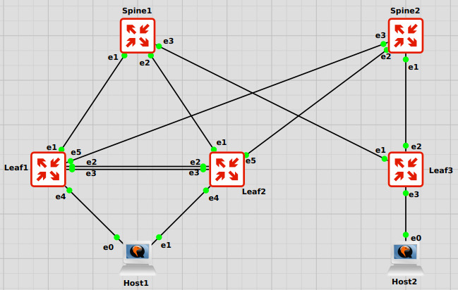

# VXLAN EVPN Multihoming

## Цель

Настроить отказоустойчивое подключение клиента к фабрике через два Leaf-коммутатора с использованием multihoming.

В лабораторной работе реализовано подключение клиента Host1 двумя линками к Leaf1 и Leaf2. На стороне Leaf1/Leaf2 настроен Arista MLAG как вариант MC-LAG с поддержкой VXLAN. На стороне клиента настроен агрегированный интерфейс bond0.

В рамках стенда GNS3 использован статический агрегированный канал:

* на Arista: `channel-group 10 mode on`;
* на Ubuntu: `bond0` в режиме `balance-xor`.

Это решение соответствует варианту MC-LAG с VXLAN. LACP/802.3ad в стенде был заменен на static LAG из-за нестабильной работы LACP между Ubuntu cloud guest и vEOS в GNS3.

## Топология



## Описание схемы

В схеме используются:

* Spine1 и Spine2 - spine-коммутаторы фабрики;
* Leaf1 и Leaf2 - MLAG-пара для отказоустойчивого подключения Host1;
* Leaf3 - обычный Leaf для подключения Host2;
* Host1 - dual-homed клиент, подключенный к Leaf1 и Leaf2;
* Host2 - single-homed клиент, подключенный к Leaf3.

Связи:

| Устройство | Интерфейс | Сосед | Интерфейс соседа |
| ---------- | --------: | ----- | ---------------: |
| Spine1     |        e1 | Leaf1 |               e1 |
| Spine1     |        e2 | Leaf2 |               e1 |
| Spine1     |        e3 | Leaf3 |               e1 |
| Spine2     |        e3 | Leaf1 |               e5 |
| Spine2     |        e2 | Leaf2 |               e5 |
| Spine2     |        e1 | Leaf3 |               e2 |
| Leaf1      |        e2 | Leaf2 |               e2 |
| Leaf1      |        e3 | Leaf2 |               e3 |
| Leaf1      |        e4 | Host1 |               e0 |
| Leaf2      |        e4 | Host1 |               e1 |
| Leaf3      |        e3 | Host2 |               e0 |

Между Leaf1 и Leaf2 настроен MLAG peer-link через Port-Channel100.

Host1 подключен через Port-Channel10, который является MLAG-интерфейсом на Leaf1 и Leaf2.

## Адресный план

### BGP ASN

| Устройство |   ASN |
| ---------- | ----: |
| Spine1     | 65000 |
| Spine2     | 65001 |
| Leaf1      | 65101 |
| Leaf2      | 65102 |
| Leaf3      | 65103 |

### Loopback

| Устройство |      Loopback0 |
| ---------- | -------------: |
| Spine1     |     1.1.1.1/32 |
| Spine2     |     2.2.2.2/32 |
| Leaf1      | 11.11.11.11/32 |
| Leaf2      | 22.22.22.22/32 |
| Leaf3      | 33.33.33.33/32 |

### VTEP

| Устройство |         Loopback1 |
| ---------- | ----------------: |
| Leaf1      | 100.100.100.12/32 |
| Leaf2      | 100.100.100.12/32 |
| Leaf3      |  100.100.100.3/32 |

Leaf1 и Leaf2 используют общий anycast VTEP `100.100.100.12/32`, так как являются MLAG-парой.

### Underlay p2p-сети

| Линк                 |         Сеть |
| -------------------- | -----------: |
| Spine1 e1 - Leaf1 e1 |  10.0.0.0/31 |
| Spine1 e2 - Leaf2 e1 |  10.0.0.2/31 |
| Spine1 e3 - Leaf3 e1 |  10.0.0.4/31 |
| Spine2 e3 - Leaf1 e5 |  10.0.0.6/31 |
| Spine2 e2 - Leaf2 e5 |  10.0.0.8/31 |
| Spine2 e1 - Leaf3 e2 | 10.0.0.10/31 |

### MLAG

| Параметр              | Значение         |
| --------------------- | ---------------- |
| MLAG domain           | MLAG_LEAF1_LEAF2 |
| Peer-link             | Port-Channel100  |
| Leaf1 MLAG control IP | 192.168.255.1/30 |
| Leaf2 MLAG control IP | 192.168.255.2/30 |
| MLAG VLAN             | 4094             |
| Client Port-Channel   | Port-Channel10   |
| Client MLAG ID        | 10               |

### Overlay

| VLAN |   VNI | Назначение  |
| ---: | ----: | ----------- |
|   10 | 10010 | Client VLAN |

### Клиенты

| Клиент | Интерфейс |             IP |    Gateway |
| ------ | --------- | -------------: | ---------: |
| Host1  | bond0     | 10.10.10.11/24 | 10.10.10.1 |
| Host2  | ens3/e0   | 10.10.10.12/24 | 10.10.10.1 |

## План настройки

1. Настроить eBGP underlay между Spine и Leaf.
2. Настроить EVPN address-family между Spine и Leaf.
3. Настроить VXLAN VNI 10010 на Leaf1, Leaf2 и Leaf3.
4. Настроить MLAG между Leaf1 и Leaf2:

   * Port-Channel100 как peer-link;
   * Vlan4094 как MLAG control VLAN;
   * общий MLAG domain.
5. Настроить Port-Channel10 к Host1:

   * Leaf1 e4 и Leaf2 e4 в static Port-Channel;
   * Port-Channel10 как MLAG-интерфейс.
6. Настроить bond0 на Host1 в режиме `balance-xor`.
7. Настроить Host2 как обычный single-homed клиент.
8. Проверить BGP, EVPN, VXLAN, MLAG, MAC-learning и клиентскую связность.
9. Проверить отказоустойчивость отключением одного из линков Host1.

## Конфигурации

Полные конфигурации устройств находятся в каталоге [configs](./configs/).

| Устройство | Файл                                       |
| ---------- | ------------------------------------------ |
| Spine1     | [configs/Spine1.cfg](./configs/Spine1.cfg) |
| Spine2     | [configs/Spine2.cfg](./configs/Spine2.cfg) |
| Leaf1      | [configs/Leaf1.cfg](./configs/Leaf1.cfg)   |
| Leaf2      | [configs/Leaf2.cfg](./configs/Leaf2.cfg)   |
| Leaf3      | [configs/Leaf3.cfg](./configs/Leaf3.cfg)   |

## Ключевые фрагменты конфигурации

### MLAG peer-link на Leaf1/Leaf2

```eos
interface Ethernet2
   channel-group 100 mode active

interface Ethernet3
   channel-group 100 mode active

interface Port-Channel100
   description MLAG_PEER_LINK
   switchport mode trunk
   switchport trunk allowed vlan 10,4094

interface Vlan4094
   ip address 192.168.255.1/30
   no autostate

mlag configuration
   domain-id MLAG_LEAF1_LEAF2
   local-interface Vlan4094
   peer-address 192.168.255.2
   peer-link Port-Channel100
```

На Leaf2 используется адрес `192.168.255.2/30`, а peer-address указывает на `192.168.255.1`.

### Клиентский MLAG Port-Channel

Leaf1:

```eos
interface Ethernet4
   description TO_HOST1_E0
   channel-group 10 mode on
   no shutdown

interface Port-Channel10
   description MLAG_TO_HOST1_BOND0_STATIC
   switchport
   switchport mode access
   switchport access vlan 10
   spanning-tree portfast
   mlag 10
   no shutdown
```

Leaf2:

```eos
interface Ethernet4
   description TO_HOST1_E1
   channel-group 10 mode on
   no shutdown

interface Port-Channel10
   description MLAG_TO_HOST1_BOND0_STATIC
   switchport
   switchport mode access
   switchport access vlan 10
   spanning-tree portfast
   mlag 10
   no shutdown
```

### VXLAN VNI

```eos
interface Vxlan1
   vxlan source-interface Loopback1
   vxlan udp-port 4789
   vxlan vlan 10 vni 10010
```

### EVPN VLAN section

```eos
router bgp 65101
   vlan 10
      rd 11.11.11.11:10010
      route-target both 10010:10010
      redistribute learned
      redistribute learned remote
```

На Leaf2 используется RD `22.22.22.22:10010`, на Leaf3 - `33.33.33.33:10010`.

## Конфигурация Host1

На Host1 используется bond0 в режиме `balance-xor`.

```yaml
network:
  version: 2
  renderer: networkd
  ethernets:
    ens3:
      dhcp4: false
      optional: true
    ens4:
      dhcp4: false
      optional: true
  bonds:
    bond0:
      interfaces:
        - ens3
        - ens4
      addresses:
        - 10.10.10.11/24
      routes:
        - to: default
          via: 10.10.10.1
      parameters:
        mode: balance-xor
        mii-monitor-interval: 100
        transmit-hash-policy: layer3+4
```

Применение:

```bash
sudo chmod 600 /etc/netplan/99-vxlan-multihoming.yaml
sudo netplan apply
sudo systemctl restart systemd-networkd
```

## Проверка

### MLAG на Leaf1

```text
Leaf1#show mlag

MLAG Configuration:
domain-id                          :    MLAG_LEAF1_LEAF2
local-interface                    :            Vlan4094
peer-address                       :       192.168.255.2
peer-link                          :     Port-Channel100
peer-config                        :          consistent

MLAG Status:
state                              :              Active
negotiation status                 :           Connected
peer-link status                   :                  Up
local-int status                   :                  Up

MLAG Ports:
Disabled                           :                   0
Configured                         :                   0
Inactive                           :                   0
Active-partial                     :                   0
Active-full                        :                   1
```

MLAG находится в состоянии `Active`, peer-link поднят, клиентский MLAG-порт находится в состоянии `Active-full`.

### Port-Channel на Leaf1

```text
Leaf1#show port-channel dense

Number of channels in use: 2
Number of aggregators: 2

   Port-Channel       Protocol    Ports
------------------ -------------- ------------------
   Po10(U)            Static      Et4(P) PEt4(P)
   Po100(U)           LACP(a)     Et2(PG+) Et3(PG+)
```

Port-Channel10 используется для подключения Host1. Port-Channel100 используется как MLAG peer-link.

### Port-Channel10 на Leaf1

```text
Leaf1#show interfaces port-channel 10 status

Port       Name                       Status       Vlan     Duplex Speed
Po10       MLAG_TO_HOST1_BOND0_STATIC connected    10       full   2G
```

Port-Channel10 поднят, находится в VLAN 10 и имеет суммарную скорость 2G.

### MAC-таблица Leaf1

```text
Leaf1#show mac address-table vlan 10

Vlan    Mac Address       Type        Ports
----    -----------       ----        -----
  10    001c.7300.0099    STATIC      Cpu
  10    0cb7.4ec3.0000    DYNAMIC     Vx1
  10    0ce9.70af.9e01    STATIC      Po100
  10    c600.7990.fa58    DYNAMIC     Po10
```

MAC Host1 изучен через `Po10`, а MAC удаленного Host2 изучен через VXLAN-интерфейс `Vx1`.

### EVPN BGP на Leaf1

```text
Leaf1#show bgp evpn summary

Neighbor V AS           State   PfxRcd
10.0.0.0 4 65000        Estab   5
10.0.0.6 4 65001        Estab   5
```

EVPN-соседства Leaf1 со Spine1 и Spine2 находятся в состоянии `Established`.

### VNI на Leaf1

```text
Leaf1#show vxlan vni

VNI         VLAN       Source       Interface            802.1Q Tag
----------- ---------- ------------ -------------------- ----------
10010       10         static       Port-Channel10       untagged
                                    Vxlan1               10
```

VNI 10010 связан с VLAN 10 и используется на Port-Channel10 и Vxlan1.

### MLAG на Leaf2

```text
Leaf2#show mlag

MLAG Status:
state                              :              Active
negotiation status                 :           Connected
peer-link status                   :                  Up
local-int status                   :                  Up

MLAG Ports:
Inactive                           :                   0
Active-full                        :                   1
```

MLAG на Leaf2 также находится в состоянии `Active`.

### Port-Channel на Leaf2

```text
Leaf2#show port-channel dense

Number of channels in use: 2
Number of aggregators: 2

   Port-Channel       Protocol    Ports
------------------ -------------- ------------------
   Po10(U)            Static      Et4(P) PEt4(P)
   Po100(U)           LACP(a)     Et2(PG+) Et3(PG+)
```

Port-Channel10 на Leaf2 также поднят и участвует в MLAG.

### MAC-таблица Leaf2

```text
Leaf2#show mac address-table vlan 10

Vlan    Mac Address       Type        Ports
----    -----------       ----        -----
  10    001c.7300.0099    STATIC      Cpu
  10    0cb7.4ec3.0000    DYNAMIC     Vx1
  10    0cd9.9bea.8b81    STATIC      Po100
  10    c600.7990.fa58    DYNAMIC     Po10
```

Host1 также виден за MLAG Port-Channel10 на Leaf2.

## Проверка Host1

```text
ubuntu@ubuntu:~$ ip addr show bond0

bond0: <BROADCAST,MULTICAST,MASTER,UP,LOWER_UP>
    inet 10.10.10.11/24 brd 10.10.10.255 scope global bond0
```

```text
ubuntu@ubuntu:~$ ip route

default via 10.10.10.1 dev bond0 proto static
10.10.10.0/24 dev bond0 proto kernel scope link src 10.10.10.11
```

```text
ubuntu@ubuntu:~$ cat /proc/net/bonding/bond0

Bonding Mode: load balancing (xor)
Transmit Hash Policy: layer3+4
MII Status: up

Slave Interface: ens4
MII Status: up

Slave Interface: ens3
MII Status: up
```

Host1 использует bond0 в режиме `balance-xor`. Оба slave-интерфейса находятся в состоянии `up`.

## Проверка связности

### Host1 - default gateway

```text
ubuntu@ubuntu:~$ ping 10.10.10.1

64 bytes from 10.10.10.1: icmp_seq=1 ttl=64 time=0.893 ms
64 bytes from 10.10.10.1: icmp_seq=2 ttl=64 time=3.56 ms
64 bytes from 10.10.10.1: icmp_seq=3 ttl=64 time=2.84 ms
64 bytes from 10.10.10.1: icmp_seq=4 ttl=64 time=2.91 ms

4 packets transmitted, 4 received, 0% packet loss
```

### Host1 - Host2

```text
ubuntu@ubuntu:~$ ping 10.10.10.12

64 bytes from 10.10.10.12: icmp_seq=1 ttl=64 time=10.7 ms
64 bytes from 10.10.10.12: icmp_seq=2 ttl=64 time=11.5 ms
64 bytes from 10.10.10.12: icmp_seq=3 ttl=64 time=10.4 ms
64 bytes from 10.10.10.12: icmp_seq=4 ttl=64 time=10.4 ms
64 bytes from 10.10.10.12: icmp_seq=5 ttl=64 time=11.2 ms

5 packets transmitted, 5 received, 0% packet loss
```

Связность между Host1 и Host2 через VXLAN EVPN L2VNI работает.

## Проверка отказоустойчивости

Для проверки отказоустойчивости был запущен постоянный ping с Host1 до Host2:

```bash
ping 10.10.10.12
```

Затем выполнялось отключение клиентского линка на Leaf1:

```eos
configure terminal
interface Ethernet4
   shutdown
end
```

После проверки линк был возвращен:

```eos
configure terminal
interface Ethernet4
   no shutdown
end
```

Аналогичная проверка была выполнена на Leaf2:

```eos
configure terminal
interface Ethernet4
   shutdown
end
```

и затем:

```eos
configure terminal
interface Ethernet4
   no shutdown
end
```

Во время отключения одного из линков наблюдалась кратковременная потеря ICMP-пакетов, после чего связность восстановилась через оставшийся линк. Это подтверждает отказоустойчивость подключения клиента через MLAG.

Фрагмент ping после переключения:

```text
64 bytes from 10.10.10.12: icmp_seq=36 ttl=64 time=3.36 ms
64 bytes from 10.10.10.12: icmp_seq=37 ttl=64 time=11.8 ms
64 bytes from 10.10.10.12: icmp_seq=64 ttl=64 time=6.23 ms
64 bytes from 10.10.10.12: icmp_seq=65 ttl=64 time=10.9 ms
64 bytes from 10.10.10.12: icmp_seq=66 ttl=64 time=8.99 ms
```

Разрыв sequence number показывает кратковременную потерю пакетов во время переключения. После переключения ICMP-ответы продолжили поступать.

## Результат

В лабораторной работе выполнено:

* настроен eBGP underlay между Spine и Leaf;
* настроен EVPN control-plane;
* настроен VXLAN L2VNI 10010 для VLAN 10;
* настроен MLAG между Leaf1 и Leaf2;
* настроен агрегированный канал Host1 через Leaf1 и Leaf2;
* настроен bond0 на Ubuntu Host1;
* проверена связность Host1 с gateway и Host2;
* проверена отказоустойчивость при отключении одного из клиентских линков.

Итог: клиент Host1 подключен отказоустойчиво через два Leaf-коммутатора, а связность с Host2 через VXLAN EVPN сохраняется после отказа одного из линков.

